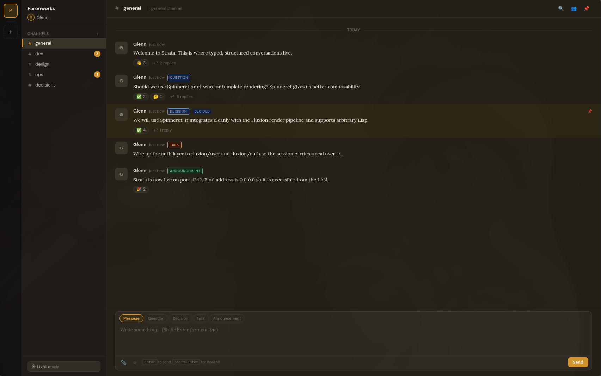
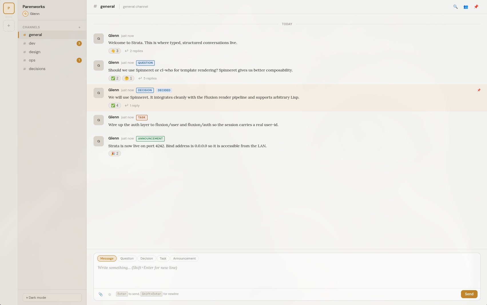

#+TITLE: Strata
#+AUTHOR: Glenn Thompson
#+DATE: 2026

* Overview

Strata is a self-hosted team workspace built on [[https://github.com/parenworks/fluxion][Fluxion]]. It improves on Slack
by making every post a typed object (question, decision, task, announcement),
resurfacing threads automatically when they are touched, and preserving resolved
items below the fold instead of deleting them.

The entire stack is Common Lisp, backed by a single PostgreSQL database.

* Screenshots

#+ATTR_ORG: :width 600

/Dark mode/

#+ATTR_ORG: :width 600

/Light mode/

* Key Features

- Typed posts: question, decision, task, announcement, message
- Thread resurfacing: replying to a thread bumps the parent post to the top
- Resolved items preserved in a collapsed drawer, not deleted
- Private channels with explicit membership
- Sub-channels (nested under a parent channel)
- Full-text search via PostgreSQL =tsvector= (planned)
- Reactive UI via Fluxion SSE - no page reloads
- User profiles (display name, title, bio, password change)
- Web Push notifications (VAPID, service worker)
- REST and MCP APIs for agent access (planned)

* Technology

| Component       | Choice                        |
|-----------------+-------------------------------|
| Language        | Common Lisp (SBCL)            |
| Web framework   | Fluxion (own)                 |
| HTTP server     | Woo (via Clack)               |
| Database        | PostgreSQL (via fluxion/db-pg)|
| HTML generation | Spinneret                     |
| Auth            | fluxion/user + fluxion/auth   |
| Background jobs | bordeaux-threads              |

* Requirements

- SBCL 2.x
- PostgreSQL 15+
- =libev-dev= (required by Woo)

* Local Setup

#+BEGIN_SRC sh
# Create the database
createdb strata_dev
psql strata_dev -c "CREATE USER strata WITH PASSWORD 'localtest123';"
psql strata_dev -c "GRANT ALL PRIVILEGES ON DATABASE strata_dev TO strata;"
psql strata_dev -c "GRANT ALL ON SCHEMA public TO strata;"

# Load and start
sbcl --eval '(asdf:load-system :strata)' \
     --eval '(strata.server:start)'
#+END_SRC

The server listens on port 4242 by default. On first run it redirects to
=/setup= to create the admin account and seed the default workspace.

* Configuration

=start= accepts keyword arguments:

| Argument        | Default        | Description              |
|-----------------+----------------+--------------------------|
| =:port=         | 4242           | HTTP listen port         |
| =:db-name=      | ="strata_dev"= | PostgreSQL database name |
| =:db-user=      | ="strata"=     | PostgreSQL user          |
| =:db-password=  | ="localtest123"= | PostgreSQL password    |
| =:db-host=      | ="localhost"=  | PostgreSQL host          |
| =:db-port=      | 5432           | PostgreSQL port          |

* Project Layout

#+BEGIN_EXAMPLE
strata/
  strata.asd
  src/
    package.lisp
    auth.lisp                    ; session user helpers, update-password
    app.lisp                     ; Fluxion app, component factory registration
    server.lisp                  ; start/stop, page routing, auth guard
    main.lisp                    ; binary entry point
    models/
      workspace.lisp
      channel.lisp
      channel-member.lisp        ; private channel membership
      push-subscription.lisp     ; Web Push subscriptions
      post.lisp
      reply.lisp
      reaction.lisp
      mention.lisp
      bookmark.lisp
      channel-read.lisp
    migrations/
      all.lisp                   ; idempotent ensure-schema
    components/
      shell.lisp                 ; main app shell
      login.lisp                 ; login + first-run setup
      profile.lisp               ; user profile page
  static/
    css/strata.css
    js/theme.js
    sw.js                        ; service worker (push notifications)
    manifest.json                ; PWA manifest
    fluxion.js                   ; Fluxion client runtime
  docs/
    API.org                      ; generated API reference
    TODO.org                     ; project task list
  tools/
    api-doc.lisp                 ; API.org generator
#+END_EXAMPLE

* API Reference

See [[file:docs/API.org][docs/API.org]] for the full generated API reference.

* License

MIT
